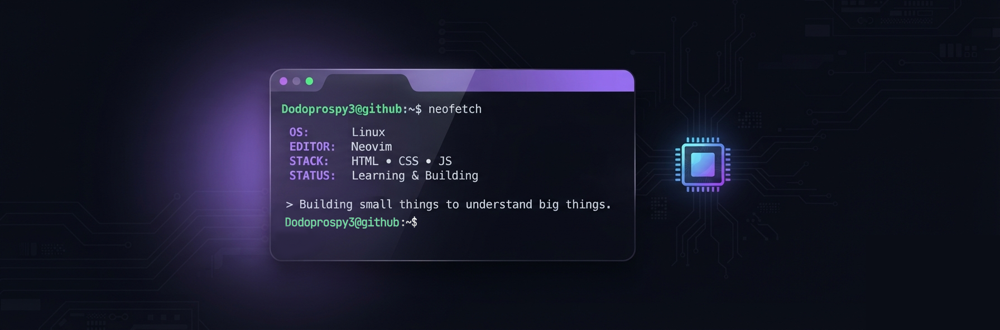

---

---

# 👋 Hello, I'm Dodoprospy3

> Student developer • Linux enthusiast • Open-source explorer • Professional bug creator

I build things, break things, and occasionally figure out why they broke.

I'm interested in understanding computers from **silicon to software**.  
Currently exploring programming, Linux, and how everything works behind the scenes.

---

---

## 🧠 Interests

- 🐧 Linux & Hyprland
- 🌐 Web development
- ⚡ Electronics
- 💻 Programming
- 🔓 Open-source software
- 🖥️ Computer systems

---

## 📚 Currently learning

- JavaScript
- HTML & CSS
- Systems programming
- Linux internals
- Git & open-source workflows

---

## ⚙️ Tools

---

## 📊 GitHub Stats

---

Building small things to understand big things. 
Curious about how computers work from silicon to software.

